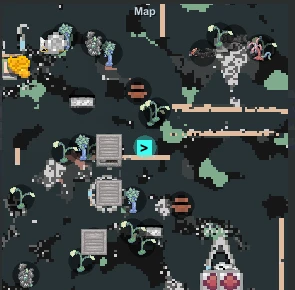
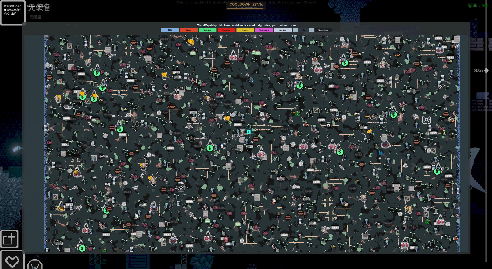

# MistalCrysMap

MistalCrysMap is a BepInEx / Harmony map overlay mod for **Casualties Unknown Demo**.

Version / 当前版本：`1.0.1`





## 中文

### 简介

MistalCrysMap 为 **Casualties Unknown Demo** 添加小地图和大地图覆盖层，帮助玩家在洞穴探索中快速判断地形、资源、危险物和自身位置。

当前定位是单人地图工具。它可以和 KrokMP 同时加载，但不会同步多人队友位置，也不依赖 KrokMP。

（未来会尝试更新在迷雾模式中可以和队友同步探索地区，并且同步队友位置。）

### 功能亮点

- 可拖动、可缩放的小地图，支持矩形、方形、圆形三种样式。

- 大地图支持缩放、平移、分类过滤和一键居中到玩家位置。

- 可选探索模式：未探索区域会被迷雾隐藏。

- 显示重要资源、可交互物、危险物、商人、怪物、掉落物和 Thornback Elder。

- 支持中键放置导航标记，并显示玩家到标记点的指示线。

- 可选择使用游戏对象自带精灵图显示标记；默认关闭，必要时可退回简单标记。

- 针对地震、怪物密集层和频繁方块更新做了刷新节流，降低地图带来的额外卡顿。

- 设置注入方式尽量温和，避免抢先初始化游戏原生 `Settings`，提高与 KrokMP 等模组的兼容性。

  **大地图上方你可以看到分类过滤和是否显示为精灵图，从左到右依次为交互物、traps（陷阱）、traders（商人）、enemies（敌人）、items（物品）、thornback（长老）、sprites（精灵图）、clear mark（删除标记）。**

### 安装

1. 安装 BepInEx。
2. 下载或构建 `MistalCrysMap.dll`。
3. 将 DLL 放入游戏目录：

```text
BepInEx/plugins/
```

4. 启动游戏，在 `Settings -> Game` 中检查 `MistalCrysMap` 设置项。

### 设置

设置位置：`Settings -> Game`

| 设置项 | 默认值 | 说明 |
| --- | --- | --- |
| `MistalCrysMap` | 开启 | 地图覆盖层总开关。 |
| `Map Toggle Key` | `M` | 显示或隐藏小地图；大地图打开时用于关闭大地图。 |
| `Exploration Map` | 关闭 | 开启后只显示已探索区域。 |
| `Minimap Shape` | `Square` | 小地图形状：矩形、方形、圆形。 |
| `Minimap Size` | `1.25x` | 小地图尺寸，范围 `0.5x` 到 `3x`。 |

### 操作

| 操作 | 作用 |
| --- | --- |
| `M` | 显示/隐藏小地图；大地图打开时关闭大地图。 |
| 左键拖动小地图 | 移动小地图位置。 |
| 小地图上滚轮 | 缩放小地图内容。 |
| 右键点击小地图 | 打开大地图。 |
| 大地图上滚轮 | 缩放大地图。 |
| 右键拖动大地图 | 平移大地图。 |
| `Home` 或大地图 `Center` 按钮 | 将大地图居中到玩家当前位置。 |
| 中键点击地图 | 放置或更新导航标记。 |
| 大地图 `Clear Mark` 按钮 | 删除导航标记。 |

### 构建

```powershell
dotnet build MistalCrysMap.csproj -c Release /p:GameManagedDir="E:\SteamLibrary\steamapps\common\Casualties Unknown Demo\CasualtiesUnknown_Data\Managed" /p:BepInExCoreDir="E:\SteamLibrary\steamapps\common\Casualties Unknown Demo\BepInEx\core"
```

输出文件：

```text
bin/Release/MistalCrysMap.dll
```

### 备注

- 地形数据来自游戏运行时的 `WorldGeneration`。
- 小地图位置、缩放、过滤开关和导航标记等 UI 状态保存在本地 `PlayerPrefs`。
- 仓库不提交构建生成的 DLL；发布给玩家时建议使用 GitHub Releases 上传编译后的 DLL。

## English

### Overview

MistalCrysMap adds a minimap and fullscreen map overlay to **Casualties Unknown Demo**. It is designed to make cave navigation easier by showing terrain, resources, hazards, enemies, traders, dropped items, and the player's current position.

The current scope is a single-player map overlay. It can be loaded alongside KrokMP, but it does not sync multiplayer teammate positions and does not depend on KrokMP.

### Highlights

- Movable and zoomable minimap with rectangle, square, and circle layouts.

- Fullscreen map with zoom, pan, category filters, and center-on-player support.

- Optional exploration mode that hides unexplored terrain behind fog.

- Markers for interactables, hazards, traders, enemies, item drops, and Thornback Elder.

- Middle-click waypoint support with a player-to-waypoint guide line.

- Optional in-game sprite markers with simple marker fallback.

- Refresh throttling for earthquakes, dense enemy layers, and frequent block updates.

- Conservative settings integration to avoid forcing early initialization of the game's native `Settings` list.

  At the top of the world map, you'll find category filters and a sprite display toggle.

  From left to right:

  \- Interactables
  \- Traps
  \- Traders
  \- Enemies
  \- Items
  \- Thornback
  \- Sprites
  \- Clear Marks

### Installation

1. Install BepInEx.
2. Download or build `MistalCrysMap.dll`.
3. Place the DLL in:

```text
BepInEx/plugins/
```

4. Launch the game and check `Settings -> Game` for MistalCrysMap options.

### Settings

Settings location: `Settings -> Game`

| Setting | Default | Description |
| --- | --- | --- |
| `MistalCrysMap` | Enabled | Master switch for the map overlay. |
| `Map Toggle Key` | `M` | Shows or hides the minimap; closes the fullscreen map while it is open. |
| `Exploration Map` | Disabled | Hides terrain until explored. |
| `Minimap Shape` | `Square` | Minimap frame shape: rectangle, square, or circle. |
| `Minimap Size` | `1.25x` | Minimap frame scale, from `0.5x` to `3x`. |

### Controls

| Control | Action |
| --- | --- |
| `M` | Toggle minimap; close fullscreen map when open. |
| Left-drag minimap | Move minimap. |
| Mouse wheel over minimap | Zoom minimap. |
| Right-click minimap | Open fullscreen map. |
| Mouse wheel over fullscreen map | Zoom fullscreen map. |
| Right-drag fullscreen map | Pan fullscreen map. |
| `Home` or fullscreen map `Center` button | Center the map on the player. |
| Middle-click map | Place or update a waypoint. |
| Fullscreen map `Clear Mark` button | Remove the waypoint. |

### Build

```powershell
dotnet build MistalCrysMap.csproj -c Release /p:GameManagedDir="E:\SteamLibrary\steamapps\common\Casualties Unknown Demo\CasualtiesUnknown_Data\Managed" /p:BepInExCoreDir="E:\SteamLibrary\steamapps\common\Casualties Unknown Demo\BepInEx\core"
```

Output:

```text
bin/Release/MistalCrysMap.dll
```

### Notes

- Terrain data is read from the game's runtime `WorldGeneration`.
- Local UI state, including minimap position, zoom, filters, and waypoint state, is stored through Unity `PlayerPrefs`.
- Build outputs are not committed to the repository. Use GitHub Releases to distribute compiled DLL files.
